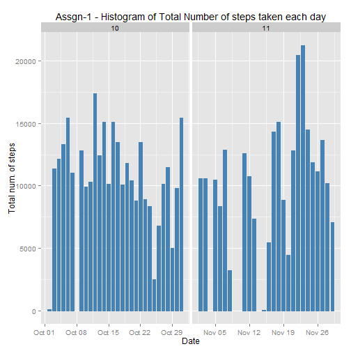
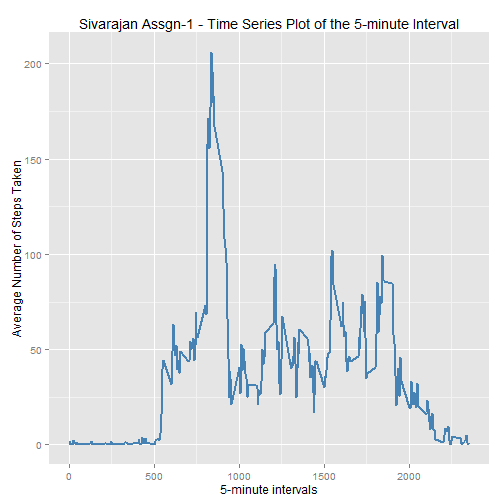
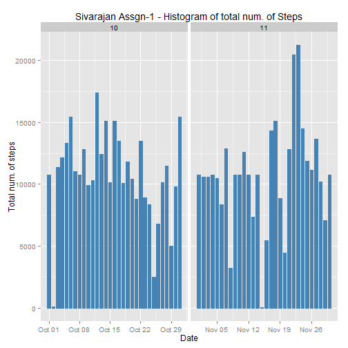
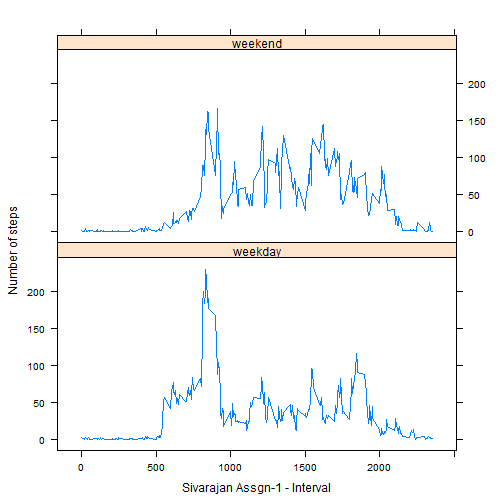

# Reproducible Research: Peer Assessment 1
==========================================
Done by Sivarajan.N on Aug 15, 2014

This first Peer assessment makes use of data from a personal activity monitoring device. This device collects data at 5 minute intervals through out the day. The data consists of two months of data from an anonymous individual collected between the months of October and November, 2012 and include the number of steps taken in 5 minute intervals each day.

### Settings used - Basic


```r
echo = TRUE # Always make code visible
options(scipen = 1) # Turn off scientific notations for numbers
```

## Loading and preprocessing the data - Step 1

Loading Steps:
1. The data CSV file is downloaded if it is not present
2. Open and Read CSV into a data frame.
3. Load activity data and transform the date variable to date class
Lets Read in the data.


```r
setwd("E:/Sivarajan/Coursera-ReproducibleResearch/PeerAssessment1")
if(!file.exists('activity.csv')){
unzip('activity.zip')
}
data <- read.csv("activity.csv", colClasses = c("integer", "Date", "factor"))
data$month <- as.numeric(format(data$date, "%m"))
noNA <- na.omit(data)
rownames(noNA) <- 1:nrow(noNA)
head(noNA)
```

```
##   steps       date interval month
## 1     0 2012-10-02        0    10
## 2     0 2012-10-02        5    10
## 3     0 2012-10-02       10    10
## 4     0 2012-10-02       15    10
## 5     0 2012-10-02       20    10
## 6     0 2012-10-02       25    10
```

```r
dim(noNA)
```

```
## [1] 15264     4
```

```r
library(ggplot2)
```


## What is mean total number of steps taken per day? - Step 2

A histogram of the daily total number of steps taken, plotted with a bin interval of 1500 steps is created. 
Also marked on the plot are the mean and median of the daily total steps.

For this part of the assignment, you can ignore the missing values in the dataset.
* Make a histogram of the total number of steps taken each day
## I will use ggplot for this assessment


```r
ggplot(noNA, aes(date, steps)) + geom_bar(stat = "identity", colour = "steelblue", 
fill = "steelblue", width = 0.7) + facet_grid(. ~ month, scales = "free") + 
labs(title = "Assgn-1 - Histogram of Total Number of steps taken each day", x = "Date", y = "Total num. of steps")
```

 

* Calculate and report the mean and median total number of steps taken per day
Mean total number of steps taken per day:

```r
totalSteps <- aggregate(noNA$steps, list(Date = noNA$date), FUN = "sum")$x
mean(totalSteps)
```

```
## [1] 10766
```
Median total number of steps taken per day:

```r
median(totalSteps)
```

```
## [1] 10765
```


## What is the average daily activity pattern? - Step 3
Calculate the mean steps for each five minute interval, and then put it in a data frame.


* Create a time series plot (i.e. type = "l") of the 5-minute interval (x-axis) and the average number of steps taken, averaged across all days (y-axis)

```r
avgSteps <- aggregate(noNA$steps, list(interval = as.numeric(as.character(noNA$interval))), FUN = "mean")
names(avgSteps)[2] <- "meanOfSteps"
ggplot(avgSteps, aes(interval, meanOfSteps)) + geom_line(color = "steelblue", size = 0.8) + 
labs(title = "Sivarajan Assgn-1 - Time Series Plot of the 5-minute Interval", x = "5-minute intervals", 
y = "Average Number of Steps Taken")
```

 
* Which 5-minute interval, on average across all the days in the dataset, contains the maximum number of steps?

```r
avgSteps[avgSteps$meanOfSteps == max(avgSteps$meanOfSteps), ]
```

```
##     interval meanOfSteps
## 104      835       206.2
```


## Imputing missing values - Step 4
* Identify the number of intervals with missing step counts the ("NA's"):
* And find the total number of rows with NAs:


```r
sum(is.na(data))
```

```
## [1] 2304
```
* Devise a strategy for filling in all of the missing values in the dataset. The strategy does not need to be sophisticated. For example, you could use the mean/median for that day, or the mean for that 5-minute interval, etc.
* Create a new dataset that is equal to the original dataset but with the missing data filled in.


```r
myPlotData <- data
for (i in 1:nrow(myPlotData)) {
if (is.na(myPlotData$steps[i])) {
myPlotData$steps[i] <- avgSteps[which(myPlotData$interval[i] == avgSteps$interval), ]$meanOfSteps
}
}
head(myPlotData)
```

```
##     steps       date interval month
## 1 1.71698 2012-10-01        0    10
## 2 0.33962 2012-10-01        5    10
## 3 0.13208 2012-10-01       10    10
## 4 0.15094 2012-10-01       15    10
## 5 0.07547 2012-10-01       20    10
## 6 2.09434 2012-10-01       25    10
```

```r
sum(is.na(myPlotData))
```

```
## [1] 0
```

* Create a histogram of the total number of steps taken each day and Calculate and report the mean and median total number of steps taken per day.
* We will use ggplot


```r
ggplot(myPlotData, aes(date, steps)) + geom_bar(stat = "identity", colour = "steelblue", 
fill = "steelblue", width = 0.7) + facet_grid(. ~ month, scales = "free") + 
labs(title = "Sivarajan Assgn-1 - Histogram of total num. of Steps", 
x = "Date", y = "Total num. of steps")
```

 

* Do these values differ from the estimates from the first part of the assignment? What is the impact of imputing missing data on the estimates of the total daily number of steps?
Mean total number of steps taken per day:


```r
newTotalSteps <- aggregate(myPlotData$steps,
list(Date = myPlotData$date),
FUN = "sum")$x
newMean <- mean(newTotalSteps)
newMean
```

```
## [1] 10766
```

Median total number of steps taken per day:


```r
newMedian <- median (newTotalSteps)
newMedian
```

```
## [1] 10766
```

Compare them with the two before imputing missing data:

```r
oldMean <- mean(totalSteps)
oldMedian <- median(totalSteps)
newMean - oldMean
```

```
## [1] 0
```

```r
newMedian - oldMedian ## compare them
```

```
## [1] 1.189
```
The new mean of total steps taken per day seems to be the same as that of the old mean; the new median of total steps taken per day is greater than that of the old median.


## Are there differences in activity patterns between weekdays and weekends? - Step 5
* Factor column for whether a day is a weekday or weekend is being added below.
* Create a new factor variable in the dataset with two levels -- "weekday" and "weekend" indicating whether a given date is a weekday or weekend day.


```r
head(myPlotData)
```

```
##     steps       date interval month
## 1 1.71698 2012-10-01        0    10
## 2 0.33962 2012-10-01        5    10
## 3 0.13208 2012-10-01       10    10
## 4 0.15094 2012-10-01       15    10
## 5 0.07547 2012-10-01       20    10
## 6 2.09434 2012-10-01       25    10
```

```r
myPlotData$weekdays <- factor(format(myPlotData$date, "%A"))
levels(myPlotData$weekdays)
```

```
## [1] "Friday"    "Monday"    "Saturday"  "Sunday"    "Thursday"  "Tuesday"  
## [7] "Wednesday"
```

```r
levels(myPlotData$weekdays) <- list(weekday = c("Monday", "Tuesday", "Wednesday", "Thursday", "Friday"), weekend = c("Saturday", "Sunday"))
levels(myPlotData$weekdays)
```

```
## [1] "weekday" "weekend"
```

```r
table(myPlotData$weekdays)
```

```
## 
## weekday weekend 
##   12960    4608
```
* Make a panel plot containing a time series plot (i.e. type = "l") of the 5-minute interval (x-axis) and the average number of steps taken, averaged across all weekday days or weekend days (y-axis).


```r
avgSteps <- aggregate(myPlotData$steps,
list(interval = as.numeric(as.character(myPlotData$interval)),weekdays = myPlotData$weekdays),FUN = "mean")
names(avgSteps)[3] <- "meanOfSteps"
library(lattice) ## load lattice
xyplot(avgSteps$meanOfSteps ~ avgSteps$interval | avgSteps$weekdays,
layout = c(1, 2), type = "l",
xlab = "Sivarajan Assgn-1 - Interval", ylab = "Number of steps")
```

 
